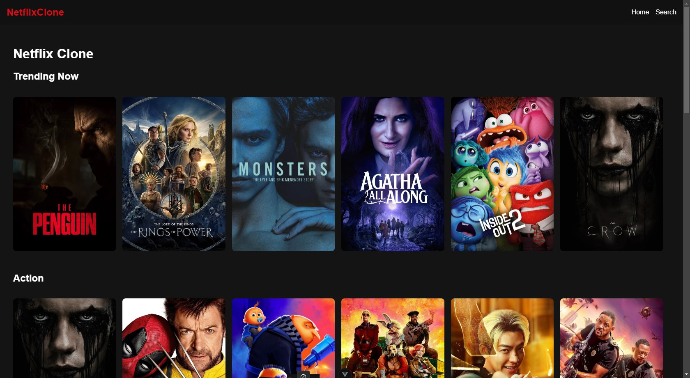

## Project Overview

This Netflix clone is built using Vue 3 and Vite, replicating key features of the Netflix user interface, including:

- Lazy loading of images for improved performance
- Movie search functionality
- Genre based movie categorization

## Preview



## What's Used?

- Vue.js 3
- Vite
- Vue Router
- Pinia for state management
- Axios for API requests
- @vueuse/motion for animations

## Project Setup

### Prerequisites

- Node.js (v14 or later recommended)
- npm or yarn

### Installation

1. Clone the repository:

   ```
   git clone https://github.com/Tramposo1312/nettflix-clone.git
   cd nettflix-clone
   ```

2. Install dependencies:

   ```
   npm install
   ```

   or if you're using yarn:

   ```
   yarn install
   ```

3. Set up environment variables:

   - Copy `.env.example` to a new file named `.env`
   - Replace `your_api_key_here` with your actual [TMDB API](https://developer.themoviedb.org/reference/intro/getting-started) key in the `.env` file

   ```
   cp .env.example .env
   ```

   Then edit the `.env` file and add your TMDB API key.

### Running the Development Server

```
npm run dev
```

or

```
yarn dev
```

The application will be available at `http://localhost:5173` by default.

## Available Scripts

- `npm run dev` or `yarn dev`: Start the development server
- `npm run build` or `yarn build`: Build the project for production
- `npm run preview` or `yarn preview`: Preview the production build locally
